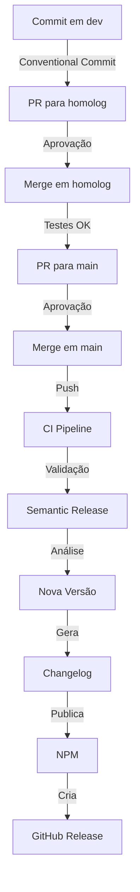

# CI/CD Pipeline Documentation

## 📋 Overview

Este projeto utiliza GitHub Actions para CI/CD automatizado com as seguintes pipelines:

## 🔄 Workflows

### 1. CI Workflow (`.github/workflows/ci.yml`)

**Trigger**: Push ou PR para `dev`, `homolog`

**Etapas**:
- ✅ Checkout do código
- ✅ Setup Bun
- ✅ Install dependencies
- ✅ Lint (ESLint)
- ✅ Type check (TypeScript)
- ✅ Build (tsup)
- ✅ Tests (bun test)
- ✅ Format check (Prettier)

**Objetivo**: Validar qualidade do código antes de merge

### 2. Release Workflow (`.github/workflows/release.yml`)

**Trigger**: Push para `main`

**Environment**: `production`

**Etapas**:
1. **Validação**
   - Lint, type check, build, tests

2. **Semantic Release**
   - Analisa commits (Conventional Commits)
   - Determina nova versão
   - Gera/atualiza CHANGELOG.md
   - Atualiza package.json
   - Cria tag Git

3. **Publicação**
   - Publica no NPM
   - Cria GitHub Release
   - Anexa artefatos

4. **Commit de Release**
   - Commit com CHANGELOG.md atualizado
   - Tag com versão

**Objetivo**: Release e deploy automatizado para produção

## 🔐 Secrets

Configure em: **Settings > Secrets and variables > Actions**

### Required Secrets

| Secret | Descrição | Como obter |
|--------|-----------|------------|
| `NPM_JS` | Token do NPM para publicação | [npmjs.com/settings/tokens](https://www.npmjs.com/settings/~/tokens) |
| `GITHUB_TOKEN` | Token para GitHub Actions | Gerado automaticamente |

### Obtendo NPM Token

1. Acesse: https://www.npmjs.com/settings/~/tokens
2. Clique em "Generate New Token"
3. Selecione "Automation" (para CI/CD)
4. Copie o token
5. Adicione no GitHub Secrets como `NPM_JS`

## 🌿 Branches

### Branch Strategy

```
dev (desenvolvimento)
  ↓ merge
homolog (homologação)
  ↓ merge
main (produção) → Dispara Release Automático
```

### Branch Protection Rules

**Main**:
- ✅ Require PR reviews (1+ aprovações)
- ✅ Require status checks (CI deve passar)
- ✅ Require up-to-date branches
- ✅ Include administrators

**Homolog**:
- ✅ Require PR reviews
- ✅ Require status checks

**Dev**:
- ✅ Require status checks

## 📝 Conventional Commits

Commits devem seguir o padrão:

```bash
<type>(<scope>): <description>

[optional body]

[optional footer]
```

### Tipos que disparam releases:

- `feat:` → MINOR (0.x.0)
- `fix:` → PATCH (0.0.x)
- `feat!:` ou `BREAKING CHANGE:` → MAJOR (x.0.0)

Ver mais em: [COMMIT_CONVENTION.md](.github/COMMIT_CONVENTION.md)

## 🚀 Release Process

### Fluxo Completo



### Exemplo Prático

```bash
# 1. Desenvolvimento
git checkout dev
git checkout -b feat/add-verbose-method
git commit -m "feat: add verbose logging method"
git push origin feat/add-verbose-method

# 2. PR para dev e merge

# 3. Homologação
git checkout homolog
git merge dev
git push origin homolog

# 4. Produção (após testes)
git checkout main
git merge homolog
git push origin main

# 🎉 Release automático é disparado!
```

## 📊 Semantic Release Configuration

Configurado em: `.releaserc.json`

### Plugins Utilizados

1. **commit-analyzer**: Analisa commits e determina versão
2. **release-notes-generator**: Gera notas de release
3. **changelog**: Atualiza CHANGELOG.md
4. **npm**: Publica no NPM
5. **git**: Commit de release
6. **github**: Cria GitHub Release

### Regras de Versionamento

| Commit | Versão | Exemplo |
|--------|--------|---------|
| `fix:` | PATCH | 1.0.0 → 1.0.1 |
| `feat:` | MINOR | 1.0.0 → 1.1.0 |
| `feat!:` | MAJOR | 1.0.0 → 2.0.0 |
| `BREAKING CHANGE:` | MAJOR | 1.0.0 → 2.0.0 |

## 🔍 Monitoramento

### Verificar Status

1. **GitHub Actions**: 
   - https://github.com/brmorillo/logger/actions

2. **NPM Package**: 
   - https://www.npmjs.com/package/@brmorillo/logger

3. **GitHub Releases**: 
   - https://github.com/brmorillo/logger/releases

### Logs

```bash
# Ver logs da última pipeline
gh run list --limit 1
gh run view <run-id> --log

# Ver releases
gh release list

# Ver tags
git tag --list
```

## 🐛 Troubleshooting

### Release não foi criado

**Causas**:
- Commits não seguem Conventional Commits
- Não há mudanças desde última release
- Erro nos testes

**Solução**:
```bash
# Verificar último commit
git log --oneline -1

# Forçar release
git commit --allow-empty -m "chore: trigger release"
git push origin main
```

### NPM Publish Falhou

**Causas**:
- Token expirado
- Versão já existe
- Permissões insuficientes

**Solução**:
1. Verificar token: Settings > Secrets
2. Gerar novo token no NPM
3. Atualizar secret `NPM_JS`

### Build Falhou

**Causas**:
- Erro de lint
- Erro de type check
- Testes falhando

**Solução**:
```bash
# Rodar localmente
bun install
bun run lint
bun run type-check
bun run build
bun test
```

## 📚 Recursos

- [GitHub Actions Docs](https://docs.github.com/en/actions)
- [Semantic Release](https://semantic-release.gitbook.io/)
- [Conventional Commits](https://www.conventionalcommits.org/)
- [NPM Publishing](https://docs.npmjs.com/cli/v8/commands/npm-publish)

## ✅ Checklist de Setup

Antes do primeiro release:

- [x] Criar repositório no GitHub
- [x] Configurar branch protection rules
- [x] Adicionar secret `NPM_JS`
- [x] Criar environment `production`
- [x] Configurar `.releaserc.json`
- [x] Adicionar workflows do GitHub Actions
- [x] Configurar `commitlint.config.js`
- [x] Fazer primeiro commit seguindo Conventional Commits
- [x] Fazer push para `main`
- [x] Verificar se release foi criado

## 🎉 Pronto!

Sua pipeline de CI/CD está configurada e pronta para uso! 🚀
