# 🚀 Release Process

Este documento descreve o processo de release automatizado para `@brmorillo/logger`.

## 📋 Processo de Release

### 1. Desenvolvimento (Branch `dev`)

```bash
# Criar feature branch a partir de dev
git checkout dev
git pull origin dev
git checkout -b feat/minha-feature

# Fazer commits usando Conventional Commits
git commit -m "feat: add new feature"
git commit -m "fix: resolve bug"

# Push e criar PR para dev
git push origin feat/minha-feature
```

### 2. Homologação (Branch `homolog`)

```bash
# Após aprovação do PR em dev, merge para homolog
git checkout homolog
git pull origin homolog
git merge dev

# Push para homolog
git push origin homolog
```

### 3. Produção (Branch `main`)

```bash
# Após testes em homolog, merge para main
git checkout main
git pull origin main
git merge homolog

# Push para main - ISSO DISPARA O DEPLOY AUTOMÁTICO
git push origin main
```

## 🤖 O que acontece automaticamente?

Quando você faz push para `main`, a pipeline de release executa:

1. ✅ **Validação**
   - Lint do código
   - Type checking
   - Build
   - Testes

2. 📊 **Análise de Commits**
   - Analisa commits desde a última release
   - Determina o tipo de versão (major, minor, patch)

3. 🏷️ **Versionamento**
   - Atualiza `package.json` com nova versão
   - Cria tag Git com a versão

4. 📝 **Changelog**
   - Gera/atualiza `CHANGELOG.md` automaticamente
   - Agrupa mudanças por tipo (Features, Bug Fixes, etc.)

5. 📦 **Publicação**
   - Publica no NPM.js
   - Cria GitHub Release
   - Anexa artefatos de build

6. 💾 **Commit de Release**
   - Faz commit com `CHANGELOG.md` e `package.json` atualizados
   - Usa `[skip ci]` para não disparar nova pipeline

## 📝 Conventional Commits

O versionamento é baseado nos commits. Use o padrão:

### Tipos de Commit

```bash
# PATCH (0.0.x) - Correções e pequenas mudanças
fix: corrigir bug no logger
perf: melhorar performance
docs: atualizar documentação
refactor: refatorar código

# MINOR (0.x.0) - Novas funcionalidades
feat: adicionar novo método verbose
feat: adicionar suporte a Winston

# MAJOR (x.0.0) - Breaking Changes
feat!: remover suporte a Node 16
BREAKING CHANGE: mudar API do logger
```

### Formato Completo

```bash
<type>[optional scope]: <description>

[optional body]

[optional footer(s)]
```

### Exemplos Reais

```bash
# Feature
feat: add verbose logging method
feat(pino): add pretty print support

# Bug Fix
fix: resolve memory leak in console logger
fix(winston): correct timestamp format

# Breaking Change
feat!: change logger initialization API

BREAKING CHANGE: LogService.getInstance() now requires options parameter
```

## 🔢 Versionamento Semântico

Seguimos [Semantic Versioning](https://semver.org/):

- **MAJOR** (X.0.0): Breaking changes
- **MINOR** (0.X.0): New features (backward compatible)
- **PATCH** (0.0.X): Bug fixes e patches

## 📦 Fluxo Completo de Release

```mermaid
graph LR
    A[Dev Branch] -->|PR Aprovado| B[Homolog Branch]
    B -->|Testes OK| C[Main Branch]
    C -->|Push| D[CI Pipeline]
    D -->|Lint & Build| E[Semantic Release]
    E -->|Análise| F[Nova Versão]
    F -->|Gera| G[Changelog]
    G -->|Publica| H[NPM]
    H -->|Cria| I[GitHub Release]
    I -->|Commit| J[Update Repo]
```



## 🛠️ Configuração

### Secrets Necessários

Configure no GitHub Settings > Secrets > Actions:

- `NPM_JS`: Token do NPM para publicação
- `GITHUB_TOKEN`: Gerado automaticamente pelo GitHub

### Branch Protection Rules

Configure em Settings > Branches:

**Branch `main`:**

- ✅ Require pull request reviews
- ✅ Require status checks to pass
- ✅ Require branches to be up to date
- ✅ Include administrators

**Branch `homolog`:**

- ✅ Require pull request reviews
- ✅ Require status checks to pass

## 🔍 Verificando o Release

Após o push para `main`:

1. **GitHub Actions**: <https://github.com/brmorillo/logger/actions>
2. **NPM Package**: <https://www.npmjs.com/package/@brmorillo/logger>
3. **GitHub Releases**: <https://github.com/brmorillo/logger/releases>

## 🐛 Troubleshooting

### Release não foi criado

**Possíveis causas:**

- Commits não seguem Conventional Commits
- Não há mudanças desde a última release
- Erro nos testes ou build

**Solução:**

```bash
# Ver logs da pipeline
gh run view --log

# Verificar último commit
git log --oneline -1

# Forçar release (apenas em casos específicos)
git commit --allow-empty -m "chore: trigger release"
git push origin main
```

### Versão errada foi gerada

**Causa comum:** Tipo de commit incorreto

**Solução:**

```bash
# Se ainda não foi publicado, fazer amend
git commit --amend
git push origin main --force

# Se já foi publicado, criar nova release
git commit -m "fix: correct version issue"
git push origin main
```

### Falha na publicação no NPM

**Possíveis causas:**

- Token NPM expirado ou inválido
- Versão já existe no NPM
- Permissões insuficientes

**Solução:**

1. Verificar token no GitHub Secrets
2. Gerar novo token no NPM: <https://www.npmjs.com/settings/~/tokens>
3. Atualizar secret `NPM_JS`

## 📚 Recursos

- [Semantic Release](https://semantic-release.gitbook.io/)
- [Conventional Commits](https://www.conventionalcommits.org/)
- [Keep a Changelog](https://keepachangelog.com/)
- [Semantic Versioning](https://semver.org/)

## ✅ Checklist para Release

Antes de fazer merge para `main`:

- [ ] Todos os testes passam
- [ ] Build está OK
- [ ] Documentação atualizada
- [ ] Commits seguem Conventional Commits
- [ ] Testado em homolog
- [ ] CHANGELOG.md será gerado automaticamente ✨
- [ ] Versão será incrementada automaticamente ✨
- [ ] NPM publish será automático ✨

## 🎉 Pronto

Agora você tem um processo de release totalmente automatizado!

Apenas faça commits seguindo o padrão, e deixe a pipeline fazer o resto! 🚀
